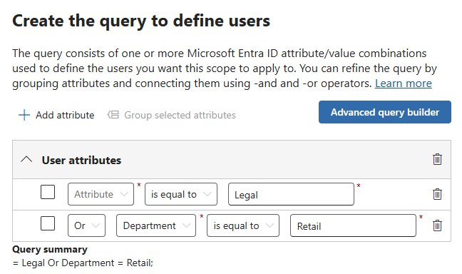

---
lab:
  task: Configure Retention Policies
  exercise: Exercise 1 - Configure Retention Policies
---

## Inquilinos de WWL: términos de uso

Si se te proporciona un inquilino porque estás realizando un curso dirigido por un instructor, ten en cuenta que ese inquilino está disponible únicamente como apoyo para los laboratorios prácticos del curso.

Los inquilinos no deben compartirse ni usarse para otros fines que no sean los de los laboratorios prácticos. El inquilino usado en este curso es un inquilino de prueba y no se puede usar ni tener acceso a él después de que la clase haya terminado y no es apto para la extensión.

Los inquilinos no se deben convertir a suscripciones de pago. Los inquilinos obtenidos como parte de este curso siguen siendo propiedad de Microsoft Corporation y nos reservamos el derecho de acceso y recuperación en cualquier momento.

# Ejercicio 1: Tareas de aptitud

La tarea consistirá en crear y administrar una directiva de retención que cumpla los criterios necesarios:

- **Directiva de retención para toda la empresa**: aplica un período de retención y establece las ubicaciones de esta directiva.
- **Directivas de retención basadas en ubicación**: crea directivas de retención para ubicaciones específicas, como canales y chats de Teams, incluso para usuarios específicos.
- **Directivas de retención de PowerShell**: implementa directivas de retención con PowerShell.
- **Directivas de ámbito adaptable**: crea y aplica directivas de retención con ámbitos adaptables para departamentos como el legal y el comercial.

## Tarea 1: Creación de una directiva de retención para toda la empresa

Aquí, crearás una directiva de retención que se aplicará a toda la organización.

1. En Microsoft Edge, ve al Portal de Microsoft Purview, `https://purview.microsoft.com`, e inicia sesión.
1. Aparecerá un mensaje sobre el nuevo Portal de Microsoft Purview en la pantalla. Selecciona la opción para aceptar los términos de divulgación del flujo de datos y la declaración de privacidad y, después, selecciona **Comenzar**.

    >

1. Selecciona **Soluciones** > **Administración del ciclo de vida de datos**.
1. Expande **Directivas** y, después, selecciona **Directivas de retención** en el panel de navegación izquierdo.
1. Selecciona **+ Nueva directiva de retención**.
1. En la página **Nombre de la directiva de retención**, escribe el nombre y la descripción:

   - **Nombre**: `Company wide`
   - **Descripción**: `All locations except for teams`

1. Selecciona **Siguiente**.
1. En la página **Ámbito de directiva**, selecciona **Siguiente**.
1. En la página **Elegir el tipo de directiva de retención que se va a crear**, selecciona **Estático** y, después, selecciona **Siguiente**.
1. En la página **Elegir dónde aplicar esta directiva**, habilita:

   - Buzones de Exchange
   - Sitios de SharePoint de comunicación y clásicos
   - Cuentas de OneDrive
   - Buzones y sitios de grupo de Microsoft 365

1. Selecciona **Siguiente**.
1. En la página **Decidir si deseas conservar contenido, eliminarlo o ambos**, para la sección **Conservar elementos de un período específico**, escribe la siguiente información:

   - **Conservar elementos durante un período específico**: elige **Personalizado** en la lista desplegable
   - Cambia el campo años a **3**
   - **Iniciar el período de retención en función de**: cuándo se modificaron los elementos por última vez
   - **Al final del período de retención**: elimina los elementos automáticamente

1. Selecciona **Siguiente**.
1. En la página **Revisar y finalizar**, selecciona **Enviar**.
1. Una vez creada la directiva, selecciona **Listo**.

Has creado correctamente una directiva de retención para toda la empresa que conserva los elementos durante tres años a partir de la fecha de la última modificación.

## Tarea 2: Creación de directivas de retención basadas en ubicación con un filtro

Aquí, crearás directivas de retención específicas para los canales y chats de Teams, incluidos los filtros para usuarios específicos.

1. Todavía deberías encontrarte en la página **Directivas de retención** del Portal de Microsoft Purview.

   Si no es así, en Microsoft Edge, ve al Portal de Microsoft Purview, `https://purview.microsoft.com`, e inicia sesión. Selecciona la tarjeta **Administración del ciclo de vida de los datos** > **Directivas** > **Directivas de retención** una vez iniciada la sesión.

1. Selecciona **+ Nueva directiva de retención**.
1. En la página **Nombre de la directiva de retención**, escribe el nombre y la descripción:

   - **Nombre**: `Teams Retention`
   - **Descripción**: `Retention for Teams locations`

1. Selecciona **Siguiente**.
1. En la página **Ámbito de directiva**, selecciona **Siguiente**.
1. En la página **Elegir el tipo de directiva de retención que se va a crear**, selecciona **Estático** y, después, selecciona **Siguiente**.
1. En la sección Elegir ubicaciones para aplicar la directiva, habilita:

   - Mensajes de canal de Teams
   - Chats de Teams e interacciones de Copilot

   Asegúrate de que el resto de las opciones están deshabilitadas.

1. Para la ubicación **Interacciones de Copilot y chats de Teams**, selecciona el vínculo **Editar** en **Todos los usuarios** y agrega dos usuarios.

    >

1. En la página flotante **Interacciones de Copilot y chats de Teams**, una vez agregados los usuarios, selecciona **Listo** y, después, selecciona **Siguiente**.
1. En la página **Decidir si deseas conservar el contenido, eliminarlo o ambos**, escribe:
   - **Conservar elementos durante un período específico**: elige **Personalizado** en la lista desplegable.
   - Cambia el campo años a 3.
   - **Iniciar el período de retención en función de**: cuándo se modificaron los elementos por última vez

1. Selecciona **Siguiente**.
1. En la página **Revisar y finalizar**, selecciona **Enviar**.
1. Una vez creada la directiva, selecciona **Listo**.

Has creado correctamente una directiva de retención para las ubicaciones de Teams con un período de retención de tres años, aplicando un filtro para usuarios específicos.

## Tarea 3: Creación de una directiva de retención con PowerShell.

En esta tarea, usarás PowerShell para crear y administrar directivas de retención.

1. Abre una ventana de PowerShell con privilegios elevados.
1. Escribe el siguiente cmdlet para instalar la versión más reciente del módulo Exchange Online PowerShell:

    ```powershell
    Install-Module ExchangeOnlineManagement
    ```

1. Confirma el cuadro de diálogo de seguridad del proveedor de NuGet con **Y** para Sí y presiona **Entrar**. Este proceso puede tardar un tiempo en finalizar.
1. Confirma el cuadro de diálogo de seguridad de repositorio no de confianza con **Y** para Sí y presiona **Entrar**.  Este proceso puede tardar un tiempo en finalizar.
1. Escribe el siguiente cmdlet para cambiar la directiva de ejecución y presiona **Entrar**. El comando supone que has iniciado sesión como usuario con los permisos adecuados.

    ```powershell
    Set-ExecutionPolicy -ExecutionPolicy RemoteSigned -Scope CurrentUser
    ```

1. Confirma el cambio de directiva de ejecución con **Y** para Sí y presiona **Entrar**.
1. Cierra la ventana PowerShell.
1. Abre una ventana normal de PowerShell, sin elevación, seleccionando el botón Windows con el botón derecho del mouse y selecciona **Windows PowerShell**.
1. Conéctate al Centro de seguridad y cumplimiento en tu inquilino con el siguiente cmdlet:

    ```powershell
    Connect-IPPSSession
    ```

1. Cuando se te solicite, inicia sesión como usuario con los permisos adecuados.
1. Ejecuta el siguiente cmdlet para crear la primera directiva de retención para todas las ubicaciones excepto para Teams:

    ```powershell
    New-RetentionCompliancePolicy -Name "Company Wide PS" -ExchangeLocation All -ModernGroupLocation All -SharePointLocation All -OneDriveLocation All
    ```

1. Ejecuta el siguiente cmdlet para establecer el período de retención, usando días como unidades en función de la fecha de modificación:

    ```powershell
    New-RetentionComplianceRule -Name "Company Wide PS Rule" -Policy "Company Wide PS" -RetentionDuration 1095 -ExpirationDateOption ModificationAgeInDays -RetentionComplianceAction Keep
    ```

Has creado correctamente directivas de retención a través de PowerShell con un período de retención de tres años.

## Tarea 4: Creación de una directiva de retención con un ámbito adaptable

En este caso, crearás una directiva de retención con un ámbito adaptable destinado a departamentos específicos, como el legal y el comercial.

1. En Microsoft Edge, ve al Portal de Microsoft Purview, `https://purview.microsoft.com`, e inicia sesión.
1. Seleccione **Settings** (Configuración) en la barra de navegación izquierda.
1. Expande **Roles y ámbitos** y selecciona **Ámbitos adaptables**.
1. En la página **Ámbitos adaptables**, selecciona **+ Crear ámbito**.
1. En la **página Nombre del ámbito de directiva adaptable** escribe:

   - **Nombre**: `Legal Documents Retention`
   - **Descripción**: `Retention for legal related documents`

1. Selecciona **Siguiente**.
1. En la **página Asignar unidades de administración**, selecciona **Siguiente**.
1. En la página **¿Qué tipo de ámbito deseas crear?**, selecciona **Usuarios** y, después, **Siguiente**.
1. En la página **Crear la consulta para definir usuarios**, en **Atributos de usuario**, selecciona:

   - **Atributo**: Departamento
   - **Operador**: is equal to
   - **Valor**: `Legal`

1. Agrega un segundo atributo con el botón **+ Agregar atributo** con valores:

   - **Operador de consulta**: Or
   - **Atributo**: Departamento
   - **Operador**: is equal to
   - **Valor**: `Retail`

    >

1. Selecciona **Siguiente** y, después, en **Enviar** en la página **Revisar y finalizar**.
1. Una vez creado el ámbito, selecciona **Listo** para volver a la página **Ámbitos adaptables**.
1. Selecciona **Soluciones** > **Administración del ciclo de vida de datos**.
1. Expande **Directivas** y selecciona **Directivas de retención**.
1. En la página **Directivas de retención**, selecciona **+ Nueva directiva de retención**.
1. En la **página Nombre a la directiva de retención**, escribe:

   - **Nombre**: `Legal Data Retention`
   - **Descripción**: `Retention of all documents within the legal and retail departments.`

1. Selecciona **Siguiente**.
1. En la página **Ámbito de directiva**, selecciona **Siguiente**.
1. En la página **Elegir el tipo de directiva de retención que se va a crear**, selecciona **Adaptable** y, después, **Siguiente**.
1. En la página **Elegir ámbitos y ubicaciones de directivas adaptables**, selecciona **+ Agregar ámbitos** y elige el ámbito **Retención de documentos legales**.
1. En **Elegir las ubicaciones donde aplicar la directiva** habilita:

   - Buzones de Exchange
   - Cuentas de OneDrive

1. Seleccione **Siguiente**.
1. En la página **Decidir si desea conservar el contenido, eliminarlo o ambos**, escribe:

   - **Retener los elementos durante un período específico**: 5 años.
   - **Iniciar el período de retención en función de**: cuándo se crean los elementos.
   - **Al final del período de retención**: no hacer nada

1. Selecciona **Siguiente** y, después, **Enviar** en **Revisar y finalizar**.
1. Una vez creada la directiva, selecciona **Listo**.

Has aplicado correctamente un ámbito adaptable a una directiva de retención.
