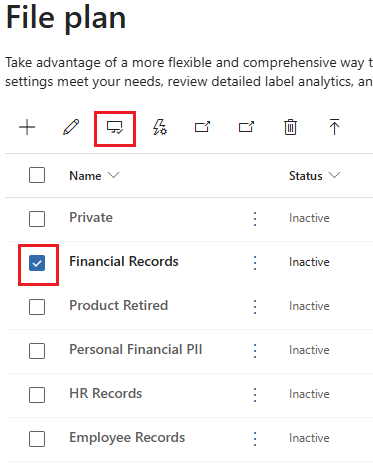

---
lab:
  task: Create retention labels
  exercise: Exercise 2 - Create retention labels
---

## Inquilinos de WWL: términos de uso

Si se te proporciona un inquilino porque estás realizando un curso dirigido por un instructor, ten en cuenta que ese inquilino está disponible únicamente como apoyo para los laboratorios prácticos del curso.

Los inquilinos no deben compartirse ni usarse para otros fines que no sean los de los laboratorios prácticos. El inquilino usado en este curso es un inquilino de prueba y no se puede usar ni tener acceso a él después de que la clase haya terminado y no es apto para la extensión.

Los inquilinos no se deben convertir a suscripciones de pago. Los inquilinos obtenidos como parte de este curso siguen siendo propiedad de Microsoft Corporation y nos reservamos el derecho de acceso y recuperación en cualquier momento.

# Ejercicio 2: Tareas de aptitud

La tarea consistirá en crear y administrar etiquetas de retención que cumplan los criterios necesarios:

- **Crear etiquetas de retención**: configura etiquetas de retención para distintos tipos de documentos y correos electrónicos.
- **Publicar etiquetas de retención**: haz que las etiquetas de retención estén disponibles para que los usuarios las apliquen.
- **Aplicar automáticamente etiquetas de retención**: configura las etiquetas de retención para que se apliquen automáticamente en función de condiciones específicas.

## Tarea 1: Creación de etiquetas de retención

En esta tarea, crearás etiquetas de retención que se pueden asignar a documentos y correos electrónicos.

1. En Microsoft Edge, ve al Portal de Microsoft Purview, `https://purview.microsoft.com`, e inicia sesión.
1. Selecciona **Soluciones** > **Administración de registros**.
1. En el panel de navegación izquierdo, selecciona **Plan de archivos**.
1. En la página **Plan de archivos**, selecciona **+ Crear una etiqueta**.
1. En la página **Nombre de la etiqueta de retención**, escribe:

    - **Nombre**: `Financial Records`
    - **Descripción para los usuarios**: `Assign this label to financial documents to ensure they are retained for the required period.`
    - **Descripción para los administradores**: `Financial records with retention period.`
1. Selecciona **Siguiente**.
1. En la página **Definir descriptores del plan de archivos para esta etiqueta**, selecciona **Siguiente**:
1. En la página **Definir configuración de etiqueta**, elige **Conservar elementos para siempre o durante un período específico** y, después, selecciona **Siguiente**.

1. En **Definir el período**, escribe:

    - **¿Cuánto dura el período?**: 7 años
    - **¿Cuándo debe comenzar el período?**: cuándo se crean los elementos
1. Selecciona **Siguiente**.
1. En la página **Elegir lo que sucede durante el período de retención**, selecciona **Conservar elementos aunque los usuarios los eliminen** y, después, selecciona **Siguiente**.
1. En la página **Elegir lo que sucede después del período de retención**, selecciona **Desactivar configuración de retención** y, después, selecciona **Siguiente**.
1. En la **página Revisar y finalizar**, selecciona **Crear etiqueta**.
1. En la página **La etiqueta de retención se crea**, selecciona **No hacer nada** y, después, selecciona **Listo**. La etiqueta se publicará más adelante en el ejercicio.
1. De nuevo en la página **Plan de archivos**, selecciona **+ Crear una etiqueta** para crear otra etiqueta de retención.
1. En la página **Nombre de la etiqueta de retención**, escribe:

    - **Nombre**: `HR Records`
    - **Descripción para los usuarios**: `This label is auto-applied to HR records with a retention period of five years.`
    - **Descripción para los administradores**: `Auto-applied retention label for HR records.`
1. Selecciona **Siguiente**.
1. En la página **Definir descriptores del plan de archivos para esta etiqueta**, selecciona **Siguiente**:
1. En la página **Definir configuración de etiqueta**, elige **Conservar elementos para siempre o durante un período específico** y, después, selecciona **Siguiente**.
1. En **Definir el período**, escribe:

    - **¿Cuánto tiempo dura el período?**: 5 años
    - **¿Cuándo debe comenzar el período?**: cuándo se crean los elementos
1. Selecciona **Siguiente**.
1. En **Elegir lo que sucede durante el período de retención**, selecciona **Conservar elementos aunque los usuarios los eliminen** y, después, selecciona **Siguiente**.
1. En la página **Elegir lo que sucede después del período de retención**, selecciona **Desactivar la configuración de retención** y, después, selecciona **Siguiente**.
1. En la página **Revisar y finalizar**, selecciona **Crear etiqueta**.
1. En la página **La etiqueta de retención se crea**, selecciona **No hacer nada** y, después, selecciona **Listo**.

Has creado correctamente etiquetas de retención para registros financieros con un período de retención de siete años y registros de RR. HH. con un período de retención de cinco años.

## Tarea 2: Publicación de etiquetas de retención

Después de la Tarea 1, ahora publicarás las etiquetas de retención para que estén disponibles para que los usuarios las apliquen a documentos en correos electrónicos de Exchange y documentos de SharePoint.

1. Todavía deberías encontrarte en la página **Plan de archivos** en el Portal de Microsoft Purview.
1. Selecciona la marca de verificación situada junto a la etiqueta de retención **Registros financieros** y, después, selecciona el botón **Publicar etiquetas**.

    >

1. En la página **Elegir etiquetas para publicar**, debe aparecer la etiqueta de retención **Registros financieros**.
1. Selecciona **Siguiente**.
1. En la página **Ámbito de directiva**, selecciona **Siguiente**.
1. En la página **Elegir el tipo de directiva de retención que se va a crear**, selecciona **Estático** y, después, selecciona **Siguiente**.
1. En la página **Elegir dónde publicar etiquetas**, selecciona **Permitirme elegir ubicaciones específicas** y habilita:

   - Buzones de Exchange
   - Sitios de SharePoint de comunicación y clásicos
   - Cuentas de OneDrive

1. Asegúrate de que los buzones y sitios de Grupos de Microsoft 365 estén establecidos en **Desactivado** y, después, selecciona **Siguiente**.
1. En la página **Nombre de la directiva** escribe:

   - Nombre: `Financial Records Retention Label`
   - Description (Descripción): `Retention label for financial records with a seven-year retention period.`
1. Selecciona **Siguiente**.
1. En la página **Finalizar**, selecciona **Enviar**.
1. En la página **La etiqueta de retención se publicó**, selecciona **Listo**.

Has publicado correctamente la etiqueta de retención para los registros financieros.

## Tarea 3: Publicación de etiquetas de retención de aplicación automática

Después de la tarea 1, ahora aplicarás automáticamente la etiqueta de retención para registros de RR. HH. con el fin de conservar la información.

1. Todavía deberías encontrarte en **Administración de registros** en el Portal de Microsoft Purview.

   Si no es así, en Microsoft Edge, ve al Portal de Microsoft Purview, `https://purview.microsoft.com`, e inicia sesión. Selecciona **Soluciones** > **Administración de registros**.

1. En el panel de navegación izquierdo, expande **Directivas** y, después, selecciona **Directivas de etiquetas**.
1. Selecciona **Aplicar automáticamente una etiqueta** para iniciar la configuración de **Crear directiva de etiquetado automático**.
1. En la página **Comencemos**, en **Nombre** y **Descripción**, escribe la siguiente información:

   - **Nombre**: `HR Records auto-applied`
   - **Descripción**: `HR Records auto-applied retention label, with a retention period of five years for all locations.`
1. Selecciona **Siguiente**.
1. En la página **Elegir el tipo de contenido al que deseas aplicar esta etiqueta**, selecciona **Aplicar etiqueta al contenido que contiene información confidencial** y, después, selecciona **Siguiente**.
1. En la página **Contenido que contiene información confidencial**, selecciona la categoría **Mejorado** y la **Regulación de datos mejorados de información de identificación personal (PII) de EE. UU.** y, después, selecciona **Siguiente**.

    >

1. En la página **Definir contenido que contiene información confidencial**, deja los valores predeterminados seleccionados y, a después, selecciona **Siguiente**.
1. En la página **Ámbito de directiva**, selecciona **Siguiente**.
1. En la página **Elegir el tipo de directiva de retención que se va a crear**, selecciona **Estático** y, después, selecciona **Siguiente**.
1. En la página **Elegir ubicaciones para aplicar la directiva**, habilita las opciones para:

   - Buzones de Exchange
   - Sitios de SharePoint de comunicación y clásicos
   - Cuentas de OneDrive
   - Buzones y sitios de grupo de Microsoft 365

1. Selecciona **Siguiente**.
1. En la página **Elegir una etiqueta para aplicar automáticamente**, selecciona **Agregar etiqueta**.
1. En la página flotante **Elegir una etiqueta** de la derecha, activa la casilla situada junto a **Registros de RR. HH.** y, después, selecciona **Agregar**.
1. De nuevo en **Elegir una etiqueta para aplicar automáticamente**, selecciona **Siguiente**.
1. En **Decidir si se va a probar o ejecutar la directiva**, selecciona **Activar directiva** y, después, selecciona **Siguiente**.
1. En la página **Revisar y finalizar**, selecciona **Enviar**. Cuando se haya creado la directiva, selecciona **Listo**.

Has publicado correctamente una etiqueta de retención con aplicación automática. En los próximos siete días, todos los documentos pertinentes se etiquetarán automáticamente con la etiqueta publicada.
