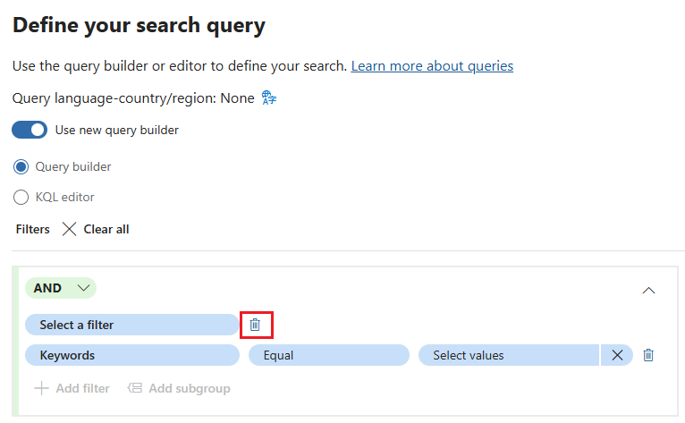
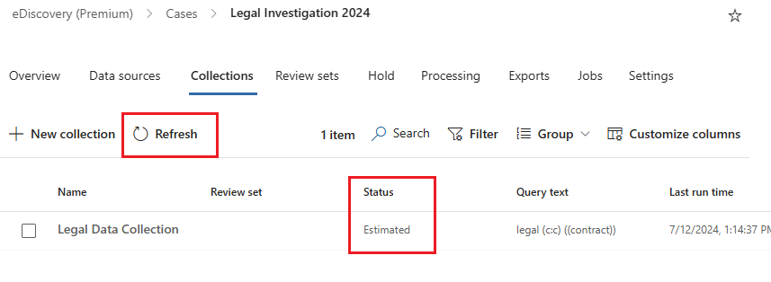
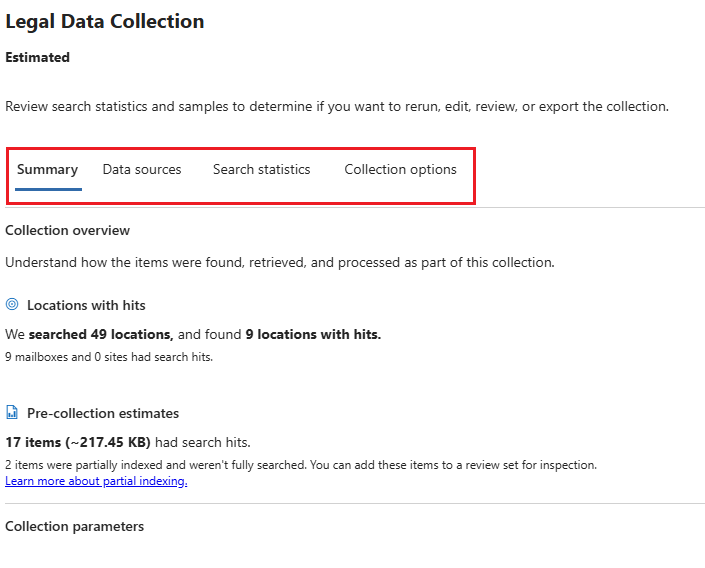

---
lab:
  task: Case investigation with eDiscovery (Premium)
  exercise: Exercise 3 - Case investigation with eDiscovery (Premium)
---

## Inquilinos de WWL: términos de uso

Si se te proporciona un inquilino porque estás realizando un curso dirigido por un instructor, ten en cuenta que ese inquilino está disponible únicamente como apoyo para los laboratorios prácticos del curso.

Los inquilinos no deben compartirse ni usarse para otros fines que no sean los de los laboratorios prácticos. El inquilino usado en este curso es un inquilino de prueba y no se puede usar ni tener acceso a él después de que la clase haya terminado y no es apto para la extensión.

Los inquilinos no se deben convertir a suscripciones de pago. Los inquilinos obtenidos como parte de este curso siguen siendo propiedad de Microsoft Corporation y nos reservamos el derecho de acceso y recuperación en cualquier momento.

# Ejercicio 3: Tareas de aptitud

La tarea consistirá en crear y administrar casos de eDiscovery que cumplan los criterios de investigación:

- **Crear un nuevo caso de eDiscovery**: configura un nuevo caso para iniciar la investigación.
- **Agregar custodios al caso**: incluye personas relevantes que puedan tener datos pertinentes.
- **Crear y ejecutar un cálculo de la recopilación**: analiza el volumen de datos y su relevancia para la investigación.
- **Revisar y refinar el cálculo de la recopilación**: asegúrate de que la colección cumple los criterios.
- **Confirmar la recopilación en un conjunto de revisión**: prepara los datos para su análisis detallado.
- **Exportar los resultados de la búsqueda**: guarda los datos recopilados con fines de revisión y cumplimiento adicionales.

>**Nota**: en este laboratorio se da por supuesto el acceso a un inquilino de M365 E5 con datos para explorar para realizar la investigación. Todavía puedes realizar este ejercicio sin datos, pero las recopilaciones y los conjuntos de revisión no producirán ningún resultado.

## Tarea 1: Concesión de permisos para eDiscovery (Premium)

Para exportar archivos, necesitarás permisos específicos debido al acceso directo que esta opción concede a los archivos de usuario.

1. En Microsoft Edge, ve al Portal de Microsoft Purview, `https://purview.microsoft.com`, e inicia sesión.
1. Selecciona **Configuración** en el panel de navegación de la izquierda.
1. En el panel de navegación izquierdo, expande **Roles y ámbitos** y, después, selecciona **Grupos de roles**.
1. En la página **Grupos de roles para soluciones de Microsoft Purview**, selecciona **Administrador de eDiscovery**.
1. En la página flotante **Administrador de eDiscovery** de la derecha, selecciona **Editar**.
1. En la página **Administrar Administrador de eDiscovery**, selecciona **Elegir usuarios**.
1. En la página flotante **Elegir usuarios** de la derecha, selecciona el usuario que usarás para realizar esta investigación de eDiscovery en los pasos siguientes y, después, selecciona **Seleccionar**.

    >**Nota**: asegúrate de seleccionar el usuario que revisará los datos y exportará los resultados de la búsqueda.

1. De nuevo en la página **Administrar administrador de eDiscovery**, selecciona **Siguiente**.
1. En la página **Administrar Administrador de eDiscovery**, selecciona **Siguiente**.
1. En la página **Revisar el grupo de roles y finalizar**, selecciona **Guardar** para agregar el usuario al grupo de roles de administrador de eDiscovery.
1. Una vez que hayas agregado correctamente los usuarios, selecciona **Listo** en la página **El grupo de roles se actualizó correctamente**.

Has concedido correctamente el permiso de administrador de eDiscovery.

## Tarea 2: Creación de un caso de eDiscovery (premium)

Ahora que tienes los permisos necesarios, podrás crear un nuevo caso de eDiscovery para comenzar la investigación.

1. En Microsoft Purview, selecciona **Soluciones** > **eDiscovery**.

   Esto te llevará directamente a la experiencia **Clásica** de **eDiscovery (Premium)**.

1. En la página **eDiscovery (Premium)**, selecciona la pestaña para **Casos** y, después, selecciona **+ Crear un caso**.
1. En la página flotante **Asignar nombre al caso** de la derecha, escribe:

   - **Nombre**: `Legal Investigation 2024`
   - **Descripción**: `eDiscovery case for the 2024 legal investigation involving relevant emails and documents.`

1. Seleccione **Siguiente**.
1. En la página **Agregar miembros del equipo y configurar la configuración**, asegúrate de agregar el usuario que llevará a cabo la investigación y selecciona **Siguiente**.
1. En la página **Revisar el caso**, selecciona **Enviar** y, después, **Listo**.

Has creado correctamente un nuevo caso de eDiscovery denominado _Legal Investigation 2024_.

## Tarea 3: Adición de custodios al caso

Ahora que se ha creado el caso, deberás agregar custodios. Los custodios son personas que pueden poseer información relevante para la investigación.

1. Después de crear el caso en la tarea anterior, debes encontrarte en la pestaña **Información general** del caso **Legal Investigation 2024**.
1. Selecciona la pestaña **Orígenes de datos** en la navegación superior y, después, selecciona **Agregar nuevo origen de datos** > **Agregar nuevos custodios**.
1. En la página flotante **Nuevo custodio**, en **Seleccionar custodio** agrega custodios a tu caso y selecciona **Siguiente**.
1. En la página **Configuración de suspensión**, asegúrate de que los custodios que agregaste en el paso anterior están seleccionados para colocar en espera.
1. En la página **Revisar los custodios**, selecciona **Enviar** y, después, selecciona **Listo** una vez creados los nuevos custodios.

Has agregado correctamente custodios al caso _Legal Investigation 2024_.

## Tarea 4: Creación y ejecución de un cálculo de la recopilación

Con los custodios agregados, ahora podrás ejecutar un cálculo de la recopilación para obtener información general sobre el volumen de datos y su relevancia.

1. Después de agregar custodios al caso en la tarea anterior, todavía debes estar en la pestaña **Orígenes de datos** del caso **Legal Investigation 2024**.  
1. Selecciona la pestaña **Colecciones** en el panel de navegación superior y, después, selecciona **+ Nueva colección**.
1. En la configuración **Nueva colección**, asigna a la colección un **nombre y una descripción**. Especifique:

   - **Nombre**: `Legal Data Collection`
   - **Descripción**: `Collecting emails and documents relevant to the 2024 legal investigation.`

1. Selecciona **Siguiente**.
1. En **Elegir orígenes de datos custodios**, selecciona **+ Seleccionar custodios**.
1. En la página flotante **Seleccionar custodios** de la derecha, agrega los custodios que se agregaron al caso en la tarea anterior y, después, selecciona **Agregar**.
1. De nuevo en la página **Elegir orígenes de datos custodios**, selecciona **Siguiente**.
1. En **Elegir orígenes de datos no custodios**, selecciona **Siguiente**.
1. En **Ubicaciones adicionales**, establece el estado en **Activado** para estas ubicaciones:

   - Buzones de Exchange
   - Carpetas públicas de Exchange

1. Selecciona **Siguiente**.
1. En la página **Definir la consulta de búsqueda**, usa el generador de consultas para crear una búsqueda para buscar contenido relevante para el caso:

   - Usa el operador **AND** para buscar **Palabras clave** **iguales**a `legal`.

    >**Nota**: es posible que tengas que eliminar la opción **Seleccionar un filtro** después de crear la consulta de búsqueda para buscar palabras clave iguales a **legal**. Si esta opción está presente, impide que agregues el subgrupo en el paso siguiente.
    >

   - Selecciona **Agregar un subgrupo**.
   - Usa el operador **OR** para buscar **Palabras clave** **iguales**a `contract`.

    >

1. Selecciona **Siguiente**.
1. En la página **Revisar la colección y crearla**, selecciona **Enviar** y, después, selecciona **Listo** en la página **Nueva colección creada**.
1. De nuevo en la página **Colecciones**, revisa el progreso del cálculo de la recopilación. Usa el botón **Actualizar** para actualizar la página y comprobar el estado del cálculo de la recopilación. Una vez que el estado del cálculo se actualiza a **Calculado** y el **Estado de la vista previa** se actualiza a **Correcto**, se completa el cálculo de la recopilación.

    >

    >**Sugerencia**: una vez completado el cálculo de la recopilación, no dudes en experimentar con la creación de diferentes consultas o con el editor de KQL para búsquedas más avanzadas. Para ello, activa la casilla situada a la izquierda del cálculo de la recopilación y selecciona **Editar colección**. Esto te llevará directamente a la página **Definir la consulta de búsqueda**. Puedes modificar la consulta y enviar un nuevo cálculo de la recopilación para explorar cómo la consulta cambia el cálculo de la recopilación.

1. Selecciona **Colección de datos legales** y explora el cálculo de la recopilación.

   - **Pestaña Resumen**: proporciona información general sobre las estadísticas de recopilación, incluidos los elementos recuperados, las ubicaciones con aciertos y los tipos de archivo.
   - **Pestaña Orígenes de datos**: muestra información sobre los orígenes de datos custodios y no custodios incluidos en la colección.
   - **Pestaña Estadísticas de búsqueda**: muestra estadísticas detalladas del último cálculo de la recopilación, incluido el número de elementos y el volumen de datos.
   - **Pestaña Opciones de colección**: enumera y explica las distintas opciones disponibles al configurar una colección, como incluir datos adjuntos en la nube e hilos de conversaciones.

    >

Has creado y revisado correctamente una colección denominada _Colección de datos legales_.

## Tarea 5: Confirmación de la colección en un conjunto de revisión

Una vez que la recopilación sea satisfactoria, la comprometerás a un conjunto de revisión para un análisis detallado.

1. Después de crear el cálculo de la recopilación en la tarea anterior, deberías estar todavía en la pestaña **Colecciones** del caso **Legal Investigation 2024**.  
1. Selecciona la colección **Colección de datos legales**.
1. En la página flotante **Colección de datos legales** de la derecha, selecciona **Confirmar colección**.
1. En la página **Confirmar elementos en un conjunto de revisión**, asegúrate de que la opción **Agregar al nuevo conjunto de revisión** está seleccionada y asígnale el nombre `Legal Case Review`.
1. Deja los demás valores predeterminados seleccionados y selecciona **Confirmar** para comprometer la colección a un conjunto de revisión.

Has comprometido correctamente la colección a un conjunto de revisión.

## Tarea 6: Exploración del conjunto de revisión

1. Después de asignar la colección a un conjunto de revisión en la tarea anterior, deberías estar todavía en la pestaña **Colecciones** del caso **Legal Investigation 2024**.
1. Selecciona la pestaña **Conjuntos de revisión** en la navegación superior y, después, selecciona el conjunto de revisión **Legal Case Review** recién creado.
1. En la página flotante **Legal Case Review** de la derecha, selecciona **Abrir conjunto de revisión** en la parte inferior de la página.
1. Explora lo que puedes hacer con los elementos del conjunto de revisión:

   1. **Filtros**: permite aplicar condiciones para restringir los elementos mostrados en el conjunto de revisión.
   1. **Etiqueta**: permite etiquetar documentos con etiquetas específicas para mejorar la organización y la identificación.
   1. **Grupo**: permite organizar el contenido del conjunto de revisión por elementos relacionados, como familias o conversaciones.
   1. **Ver origen**: proporciona una vista enriquecida del documento seleccionado, que se muestra en su formato original.
   1. **Ver texto sin formato**: muestra el texto extraído de un documento, ignorando las imágenes incrustadas y el formato.
   1. **Anotación**: permite a los usuarios aplicar marcados, redacciones y otras anotaciones en el documento.
   1. **Ver metadatos**: muestra varios metadatos asociados al documento seleccionado para obtener información detallada.

    >

1. Una vez que hayas explorado el conjunto de revisión, puedes exportar elementos para su análisis posterior.

Has abierto y revisado correctamente el conjunto de revisión.

## Tarea 7: Exportación de los resultados de búsqueda

Para guardar el trabajo y habilitar el análisis adicional, exportarás los resultados de la búsqueda.

1. Todavía deberías estar en el conjunto de revisión **Legal Case Review** en eDiscovery (Premium).
1. Activa la casilla situada junto a los elementos que deseas exportar para su posterior análisis.
1. Selecciona el elemento desplegable para **Acciones** > **Exportar**.

    >

1. En la página flotante **Opciones de exportación** de la derecha, escribe:

   - **Nombre de exportación**: `LegalCaseExport_July2024`
   - **Descripción**: `Export of relevant emails and documents for the July 2024 legal case investigation.`
   - **Exportar estos documentos**: solo documentos seleccionados
   - **Expandir selección**: Ninguno
   - **Opciones de salida**: estructura de directorios condensada

1. Selecciona el botón **Exportar** de la parte inferior de la página flotante.

    >

1. Debes recibir una notificación que indique que **Se ha creado un trabajo** para exportar el conjunto de revisión. Selecciona **Aceptar** en esta notificación.
1. Para acceder al conjunto de revisión exportado, expande **Casos Premium** en el panel de navegación izquierdo y, después, selecciona **Casos**. Selecciona el caso **Legal Investigation 2024** y, después, la pestaña **Exportaciones** en la navegación superior.
1. Selecciona la exportación **LegalCaseExport_July2024**.
1. En la página flotante **LegalCaseExport_July2024** de la derecha, activa la casilla situada junto a la izquierda de cada archivo exportado y selecciona **Descargar**. Esto descargará un archivo .csv de resumen y un archivo ZIP de elementos exportados.

    >**Sugerencia**: es posible que tengas que deshabilitar el bloqueador de elementos emergentes para descargar correctamente los archivos exportados.

Has exportado correctamente los resultados de búsqueda para su revisión.
